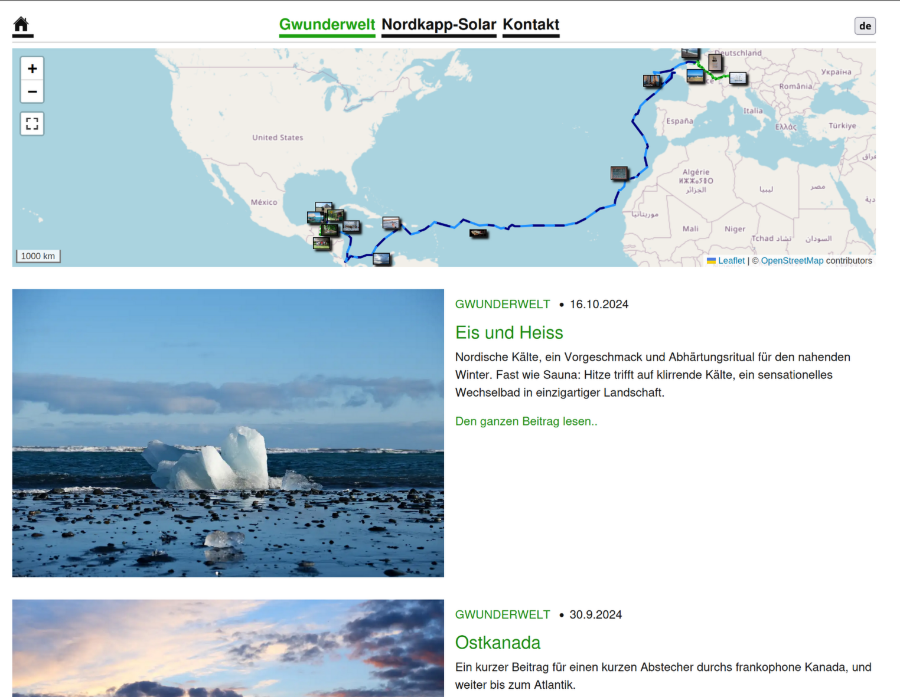

# jekyll-travel-blog

jekyll-travel-blog is a responsive theme specifically aimed at
*documenting your journey around the world*. It is based on
[Minima](https://github.com/jekyll/minima/) but heavily modified.

This repository contains a working example blog including necessary
javascript to get you started.



## Highlight Features
- travel-blog layout featuring an interactive map with your animated GPX track
  and a list of posts. To appreciate the animated map check a blog with
  sizeable content, e.g. my [Homepage](https://greuters.github.io/)
- Responsive design optimized for mobile and desktop
- integrated picture support:
  [jekyll_picture_tag](https://rbuchberger.github.io/jekyll_picture_tag/),
  [lightGallery](https://www.lightgalleryjs.com/), custom float layouts and
  equal-height image divider
- sort galleries and enrich images with metadata using front-matter
- contact form to receive emails from your visitors securely
- multi-language and i18n using
  [jekyll-polyglot](https://github.com/untra/polyglot)
- basic helper scripts to initialize blog posts and prepare GPX data

## Installation

To create a new blog based on jekyll-travel-blog, fork this repository and
adapt the provided example. This section gets you up and running.

1. Install [Jekyll](https://jekyllrb.com/docs/installation/)

2. Install [npm](https://docs.npmjs.com/downloading-and-installing-node-js-and-npm)

3. Install build dependencies **(on Ubuntu)**

```console
    $ sudo apt install libvips webp libjpeg-dev 
```

4. Install javascript and ruby dependencies

```console
    $ npm ci
```

5. Make sure to set `baseurl` correctly in both `_config.yml` and `package.json`. To deploy on Github Pages: if you build an organization or user site, remove it alltogether. For project sites, specify the repository name after an initial `/`.

   **Note:** http-server, used to serve your site during development, does not support a base url yet but should do so with the next release (date not announced yet). For the moment, a workaround is provided in `package.json` to build project sites locally.

To get upstream changes, sync your fork e.g. on [Github](https://docs.github.com/en/pull-requests/collaborating-with-pull-requests/working-with-forks/syncing-a-fork)
and run `npm ci` again.

To publish your site with the provided [Github Action](https://docs.github.com/en/actions),
create a branch named `gh-pages` and set it as your
[publishing source](https://docs.github.com/en/pages/getting-started-with-github-pages/configuring-a-publishing-source-for-your-github-pages-site).

## Usage

### Build and test locally

To build your blog run

    $ npm run build

and serve it with

    $ npm run serve

### Global Configuration

| Variable | Type | Default | Specification |
| -------- | ---- | ------- | ------------- |
| `title` | String | --- | The title of the website |
| `author` | String | --- | The name of the website author |
| `email` | String | --- | *Optional:* Email to contact you - if given, a mailto link will be set in the footer.<br>*Make sure to use spam protection!* |
| `github_username` | String | --- | *Optional:* Your name on github |
| `rss` | String | --- | *Optional:* title of the link to your rss feed, if you want to enable it |
| `contact_form_action` | Url | --- | *Optional:* URL to post messages to; mandatory if you want to use the contact.html page - tested with [formspree](https://formspree.io) |
| `navigation_urls` | Array | --- | Relative links to the pages you want in the navigation bar, ordered |
| `default_lang` | String | `en` | By polyglot: what is your default "fallback" language for your content |
| `languages` | Array | [`en`] | By polyglot: what i18n languages you wish to support; these are available in navigation as well |

### Travel Blog Configuration
| Variable | Type | Default | Specification |
| -------- | ---- | ------- | ------------- |
| `permalink` | String | --- | Add a permalink for this blog |
| `post_category` | String | --- | Category of posts that should be listed here |
| `init_bounds` | String | --- | `SE` and `NW` corner of the initial map region to show; format: `"[[Lat0, Lon0], [Lat1, Lon1]]"` |
| `lang` | String | --- | i18n language of this blog |

### Post Configuration

| Variable | Type | Default | Specification |
| -------- | ---- | ------- | ------------- |
| `lang` | String | --- | i18n language of this post |
| `title` | String | --- | Title of the post |
| `preview_text` | String | --- | Text shown on the travel-blog about this post |
| `preview_image_id` | String | --- | image_metadata id of the preview image shown on the travel-blog |
| `lat_lng` | String | `""` | *Optional:* where to show the post preview image on the map; format: `"[Lat, Lng]"` |
| `track_number` | Int | --- | *Optional:* number of the GPX track to associate this post with |
| `spread_direction` | String | --- | *Optional:* move the preview image in this direction in low zoom levels to reduce overlapping; valid values: [`N`, `NE`, `E`, `SE`, `S`, `SW`, `W`, `NW`] |
| `image_metadata` | Array | --- | *Optional:* List of image directories used in this post; see [[Init Post](#init-post)] |

### Init Post

Adding `image_metadata` can be a cumbersome task - best put your images into
`assets/images/post_category/post_name` first and use the provided `init_blog.sh`
script. If you plan to add galleries to your post, put the corresponding images
into subfolders. Then run 

    $ ./init_blog.sh post_category post_name

and the default language version of your blog is created with `image_metadata` all set up.

### Add GPS tracks

GPS tracks should be added to `assets/tracks/post_category` for each travel-blog.
Each track must have a low and a high resolution file named according to the
following schema:

`trackNumber_dd-mm-YYYY_vehicle_resolution.gpx`

where `vehicle` can be one of [`bicycle`, `sail`, `fossile`]
and `resolution` one of [`lowres`, `highres`].

Track numbers have to be consecutive increasing integers starting from `0000`.

Example: `0000_17-12-2022_bicycle_highres.gpx`, `0001_18-12-2022_bicycle_lowres.gpx`

Lowres tracks should be in the range of a few KB, highres can be around 150KB
per day to still provide a good user experience -
[GpsBabel](https://www.gpsbabel.org/) is your friend!

`convert_tracks.py` is a simple helper script to convert .NMEA (e.g. from
[CycleAnalogger](https://ebikes.ca/product-info/grin-products/analogger.html)),
.gpx (tested with [LocusMap](https://www.locusmap.app/)) and manual .csv files
to low- and highres versions. (*TODO: cleanup script, document usage &
dependencies*)

## Contributing

Bug reports and pull requests are welcome on GitHub at
[jekyll-travel-blog](https://github.com/greuters/jekyll-travel-blog).

This project is intended to be a safe, welcoming space for collaboration, and
contributors are expected to adhere to the
[Contributor Covenant](https://www.contributor-covenant.org/) code of conduct.

## License

The theme is available as open source under the terms of the [MIT License](https://opensource.org/licenses/MIT).
